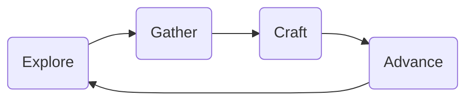

# Design

## Game Loop

## Pillars

### 1. French Vanilla

The themes and aesthetic of the pack should remain familiar and well-integrated
with the base game.

- Tech level should not exceed the
  [First Industrial Revolution](https://en.wikipedia.org/wiki/Industrial_Revolution)
  except through fantastical means such as redstone and ender pearls.

- No overhauls to the core look and feel of the vanilla game. No texture packs,
  bundled shaders, audio overhauls, etc.

- Strong preference for environmental interaction in lieu of GUIs.

### 2. Altered Progression

Like a Skyblock pack, the pack should alter recipes and add mechanics which
alter the standard flow of advancement.

- This is a quest-driven pack with stages.

- Stages should be gated by resources with unusual means of acquisition.

- The start of the game is slower and harder to encourage caution and
  engagement, and to nudge players into settling down.

- Ultimine and automation options significantly reduce tedium of midgame.

### 3. Adventure

Exploration, survival, and to a lesser extent combat, should all be accentuated.

- New structures, biomes, crops, and animals.

  - Materials gathered from these sources should facilitate new recipes. This
    connects exploration, gathering, crafting, and advancement, forming the core
    game loop.

- Enhanced danger and limitations.

- Collection mechanics to make every new item worthwhile.

### 4. Settlement

To complement the focus on Adventure, there should be a corresponding focus on
developing a compelling home base to return to between expeditions.

- Aesthetic customization options should be plentiful.

- Bases should be places to construct new crafting stations and large machines,
  which would otherwise be too numerous and cumbersome to transport. The
  machines and the recipes they facilitate require materials which the player
  will incrementally gain access to, making them a constant touch point.

- Slow automation mechanics should provide rewarding returns on time investment
  while encouraging players to set-it-and-forget-it and explore while their
  machines churn away.

### 5. Integration

As much as it makes sense, mods should be integrated with one another. This will
involve both mods which have built-in integrations and modded recipes to create
integrations.

### 6. Convenience

Except when another design pillar requires it, the pack and progress within it
should as much as possible reduce tedium and grind, and should provide helpful
shortcuts for common tasks. The pack should respect the player's time.

## Features

These hook into more than one pillar.

### More Travel Options

Arguably the biggest enhancement to the moment-to-moment gameplay. Hooks into
Adventure and Convenience.

### Expanded Agriculture

As new biomes add new plants to gather and animals to tame, they create new
options for farming, husbandry, and cooking. Connects Adventure and Settlement.
